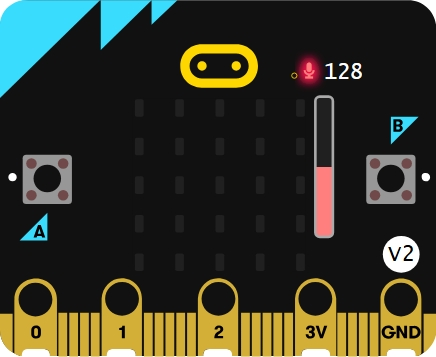

# 🔊 Luces por aplauso

Este proyecto utiliza la placa micro:bit para detectar sonidos fuertes (como un aplauso) y encender una animación LED. Es ideal para introducir conceptos como sensores, eventos y condicionales en programación educativa.

## 🧠 ¿Qué aprende el estudiante?

- Uso de sensores de sonido.
- Programación de eventos (`on_sound_loud`).
- Condicionales y lógica booleana.
- Visualización con matriz LED.

## 🖼 Simulador 

## 🎬 ¿Qué hace el proyecto?

Cuando el micro:bit detecta un sonido fuerte (como un aplauso), alterna entre mostrar una figura en la matriz LED y apagarla. Es una forma divertida de enseñar interacción física con el entorno.

---

© Marisol Rivera Solorzano – Este tutorial forma parte del repositorio educativo **Proyectos micro:bit**.  
Distribuido bajo licencia [CC BY-NC-SA 4.0](https://creativecommons.org/licenses/by-nc-sa/4.0/).  
Se permite su uso y adaptación con atribución, sin fines comerciales y compartiendo bajo la misma licencia.
