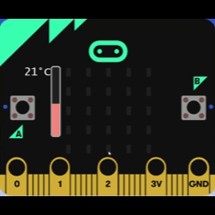

# 🌡️ Termómetro digital

Este proyecto utiliza el sensor de temperatura del micro:bit para mostrar el clima ambiente en tiempo real. Es ideal para introducir conceptos como sensores, condicionales y visualización de datos en programación educativa.

## 🧠 ¿Qué aprende el estudiante?

- Lectura de sensores internos (`input.temperature()`).
- Uso de condicionales (`if`, `elif`, `else`).
- Visualización numérica y gráfica en la matriz LED.
- Lógica de control basada en rangos de temperatura.

## 🎬 ¿Qué hace el proyecto?

El micro:bit mide la temperatura ambiente y la muestra en pantalla. Según el valor detectado:
- Si la temperatura es mayor o igual a 30 °C, muestra una cara triste 😟.
- Si es menor o igual a 15 °C, muestra una cara dormida 😴.
- Si está entre 16 °C y 29 °C, muestra una cara feliz 😊.

## 🖼 Simulador

## 🧰 Materiales

- Placa micro:bit (v1 o v2).
- Cable USB o batería.
- Editor MakeCode o Python.

## 🧩 Extensión didáctica
- Comparar temperaturas en distintos ambientes.

- Crear alertas visuales para temperaturas extremas.

- Integrar con sensores externos para mayor precisión.
---

© Marisol Rivera Solorzano – Este tutorial forma parte del repositorio educativo **Proyectos micro:bit**.  
Distribuido bajo licencia [CC BY-NC-SA 4.0](https://creativecommons.org/licenses/by-nc-sa/4.0/).  
Se permite su uso y adaptación con atribución, sin fines comerciales y compartiendo bajo la misma licencia.

