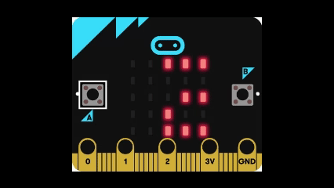

# 🧮 Fracciones con Pantalla LED

Este proyecto utiliza la matriz LED de la placa micro:bit para representar fracciones de forma visual. Es ideal para enseñar conceptos matemáticos básicos como partes de un entero, equivalencias y proporciones, integrando programación y pensamiento lógico.

## 🎯 ¿Para qué sirve?

- Representar fracciones como partes encendidas de la matriz LED.
- Visualizar equivalencias (por ejemplo, 1/2 = 4/8).
- Introducir bucles y condicionales en programación.
- Fomentar el aprendizaje activo y visual de matemática.

## 🖼 Simulador

